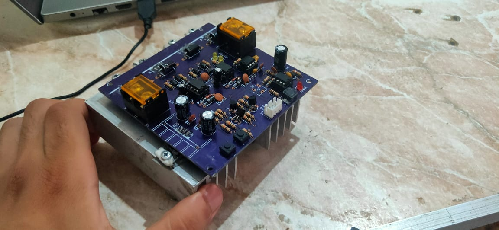
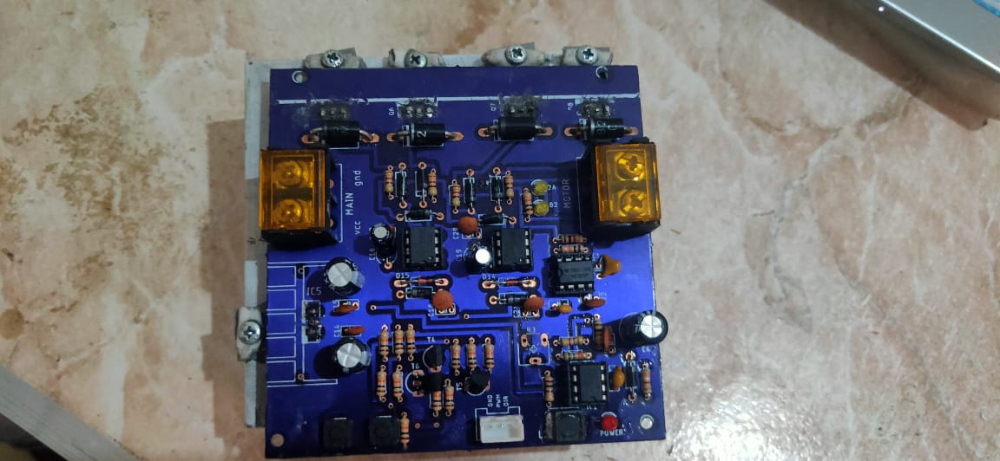
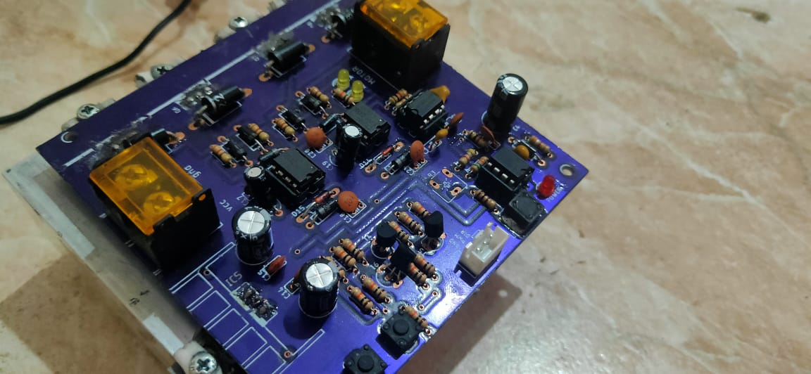
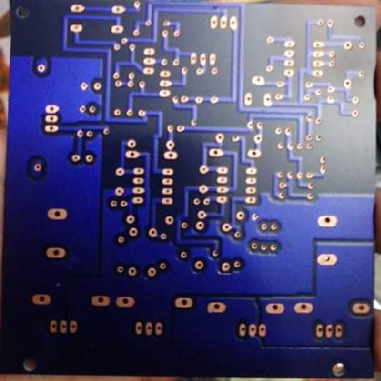
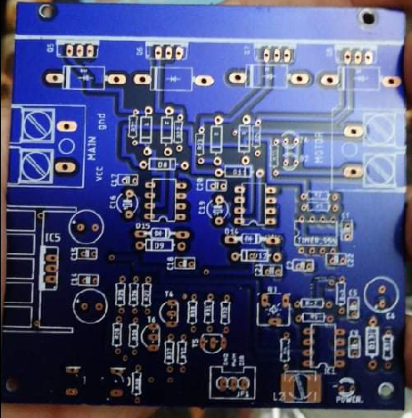

# Motor Driver Design
This repository contains the latest version of my motor driver design project. My role in the project included reverse engineering a Cytron 10-A motor driver, redesigning the driver circuit using Eagle PCB tool, and designing multiple versions to improve the design.

## Latest Version
Below is a picture of the latest version of the motor driver circuit board:

|  |  |  |
| ------- | ------- | ------- |
|  |  |  |
|  |  |  |
|  |  | | |

## Files
The repository contains the following files:
- Schematics and PCB layout files for different versions of the motor driver circuit
- Pictures of the fabricated PCBs for each version

## Contact
If you are interested in my services for your next PCB design and fabrication project, please feel free to contact me.

Email: **eng-islam-abdo1722@alexu.edu.eg**